# WORMHOLE BlOG
[](https://github.com/wormhole1996/blog/releases)
[](https://github.com/wormhole1996/blog/network/members)
[](https://github.com/wormhole1996/blog/stargazers) 
[](https://github.com/wormhole1996/blog/archive/master.zip)
[](https://github.com/wormhole1996/blog/releases)
[](https://github.com/wormhole1996/blog/blob/dev/LICENSE)

## 介绍
wordpress用得不爽了, 于是自己写了一个博客系统, 我将它命名为虫洞(wormhole). 部署简单, 完全基于互联网轻量级框架开发, 整合redis缓存, shiro安全认证授权框架, 
集成MarkDown编辑器, 用程序员最舒服的书写方式写博客. 不管你以学习为目的还是使用为目的, 这个项目都是不错的选择.

## 技术架构
* Ioc容器 - [Spring](https://spring.io/projects/spring-framework)
* MVC框架 - [Spring MVC](https://spring.io/projects/spring-framework)
* 持久化框架 - [Mybatis](http://www.mybatis.org/mybatis-3/)
* 缓存 - [Redis](https://redis.io/)
* 认证授权安全框架 - [Shiro](http://shiro.apache.org/)
* 模板渲染引擎 - [Freemarker](https://freemarker.apache.org/)
* 模块化前端框架 - [Layui](https://www.layui.com/)
* markdown编辑器 - [editor.md](http://pandao.github.io/editor.md/examples/)
* 日志系统 - [slf4j](https://www.slf4j.org/) + [logback](https://logback.qos.ch/)

## 使用说明
只需要将db.properties中的jdbc.username和jdbc.password改为你的数据库账户和密码,然后将war包扔进webapp目录即可,容器初始化时会自动建表,无需手动建表.

## 运行环境
* JDK 1.8
* MySQL(MariaDB)
* Tomcat 9.0.8
* Redis 4.0.9

## 扩展接口
>项目最初的设想是使用前后端分离的架构, 但ajax对搜索引擎并不友好, 后来页面改为了由后端freemarker渲染, 于是乎这部分接口就被废除了.

## 环境搭建
>图片较多, 推荐使用CDN或Nginx做动静分离实现负载均衡, 有时间我会附加一个环境自动化搭建shell脚本.
### Linux 环境部署
1.下载并解压 [JDK 1.8](https://www.oracle.com/technetwork/java/javase/downloads/jdk8-downloads-2133151.html)
>注意不要用linux自带的openjdk
```
tar zxvf jdk-8u172-linux-x64.tar.gz
mv jdk1.8.0_172 /usr/local/jdk
```
2.下载并解压 [Redis 4.0.9](http://www.redis.cn/download.html)
```
tar zxvf redis-4.0.9.tar.gz
mv redis-4.0.9 /usr/local/redis
```
3.下载并解压 [Tomcat 9.0.8](https://tomcat.apache.org/download-90.cgi)
```
tar zxvf apache-tomcat-9.0.8.tar.gz
mv apache-tomcat-9.0.8 /usr/local/tomcat
```
4.安装MySQL或MariaDB
>注意!如果是mariadb需要将user表中的plugin字段值'unix_socket'改为'mysql_native_password',否则jdbc连接会出错
* Debian系列Linux参考以下过程
```
#apt-get update //获取最新软件包
#apt-get install mariadb mariadb-server //安装mariadb客户端和服务器
#service mysql start //启动服务
#mysql_security_installation //执行安全安装脚本
```
* Redhat系列Linux参考以下过程
```
#yum update
#yum install mariadb mariadb-server
#systemctl start mariadb
#mysql_security_installation
```
5.设置环境变量(用vim打开/etc/profile这个文件,在后面添加以下内容)
```
export JAVA_HOME=/usr/local/jdk
export JRE_HOME=$JAVA_HOME/jre
export CLASSPATH=.:$JAVA_HOME/lib/dt.jar:$JAVA_HOME/lib/tools.jar:$JAVA_HOME/lib:$JRE_HOME/lib:$CLASSPATH
export PATH=$JAVA_HOME/bin:$JRE_HOME/bin:$PATH

export CATALINA_HOME=/usr/local/tomcat
export CATALINA_BASE=/usr/local/tomcat
export PATH=$CATALINA_HOME/bin:$PATH

export PATH=/usr/local/redis/bin:$PATH
```
6.启动redis和tomcat
```
redis-server &
startup.sh
```
7.将打包好的war包放入tomcat的app目录
### Windows 环境部署
步骤省略
### MAC 环境部署
步骤省略

## 效果演示
### 主页
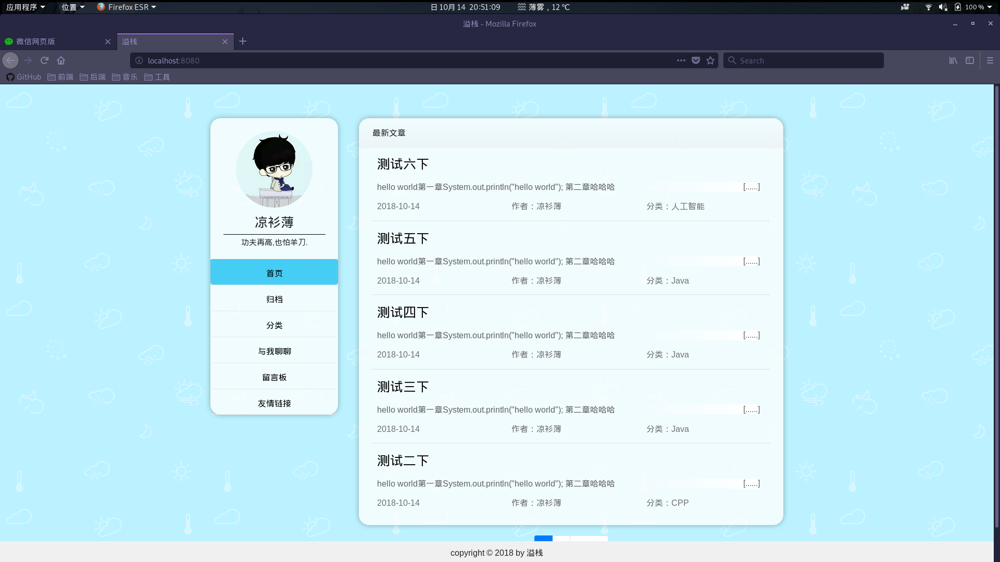
### 分类页

### 文章浏览页
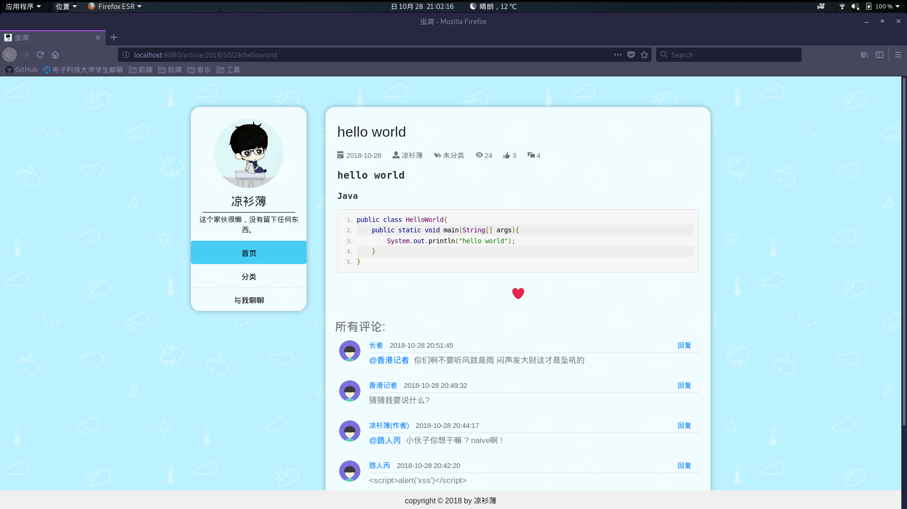
### 流量分析
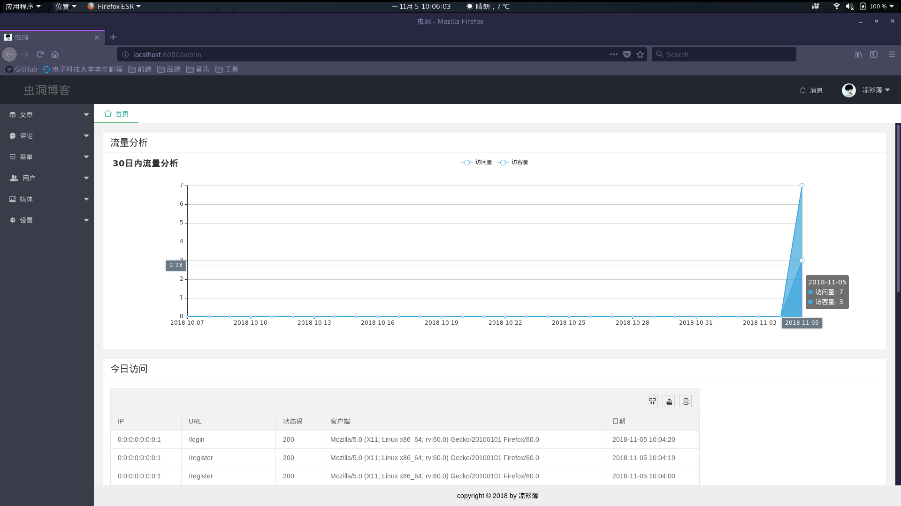
### 写文章界面
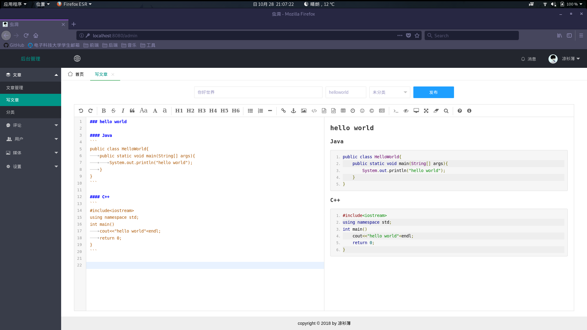
### 文章管理界面
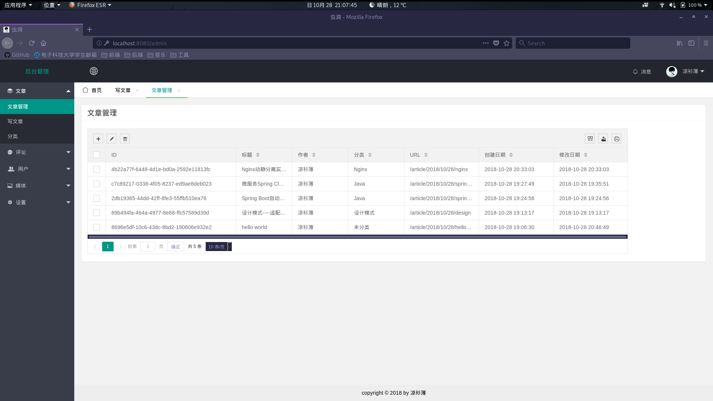
### 分类管理界面
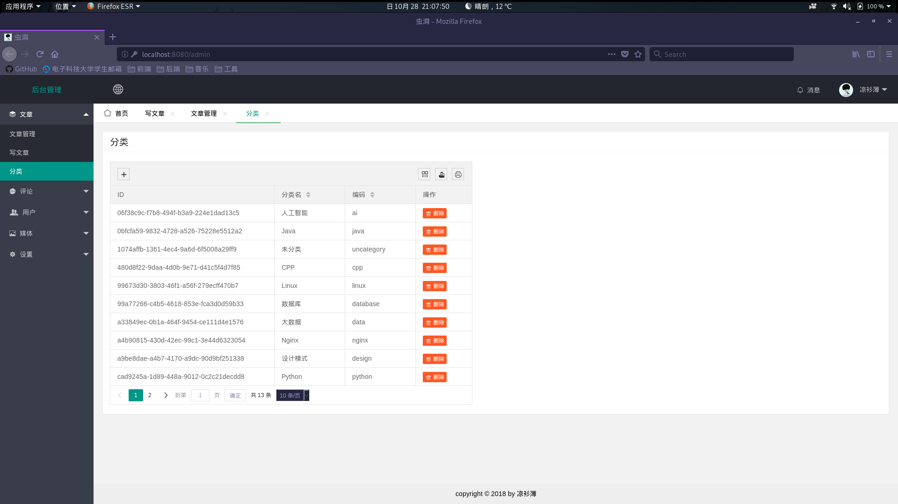
### 文章更新页面
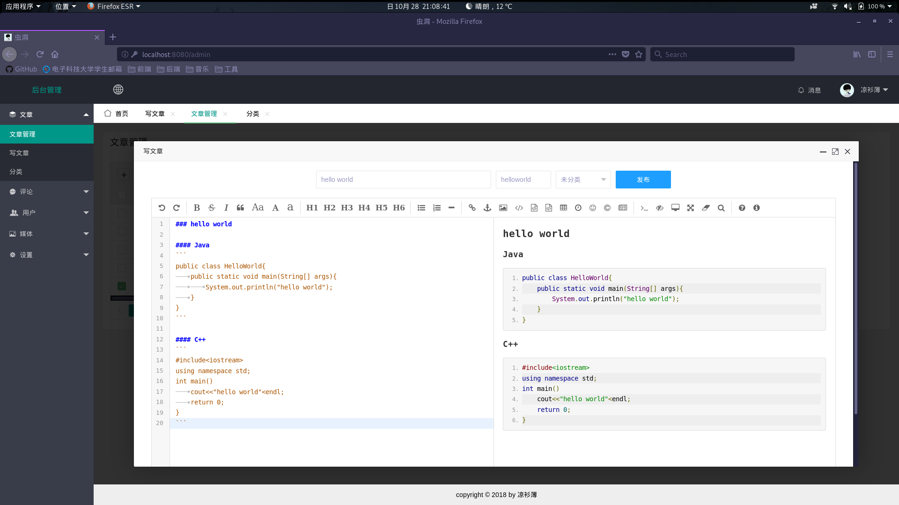
### 评论管理
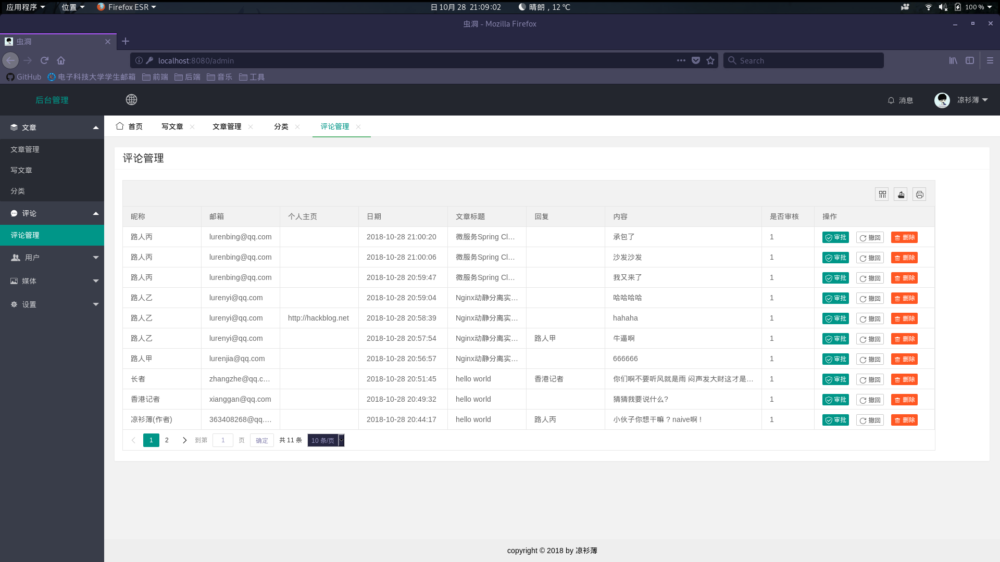
### 自定义菜单管理
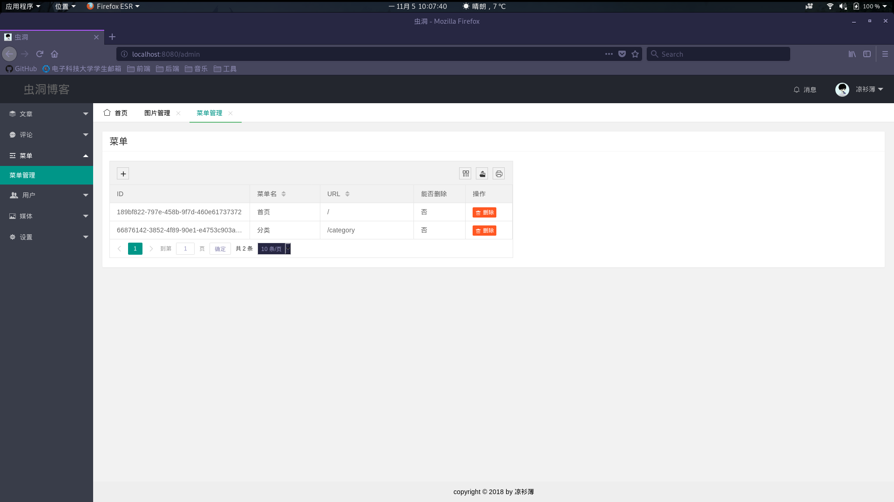
### 图片管理
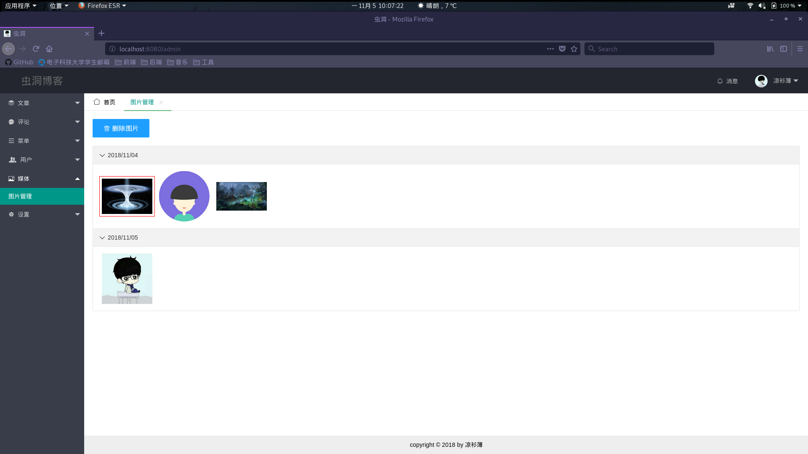
### 网站信息设置
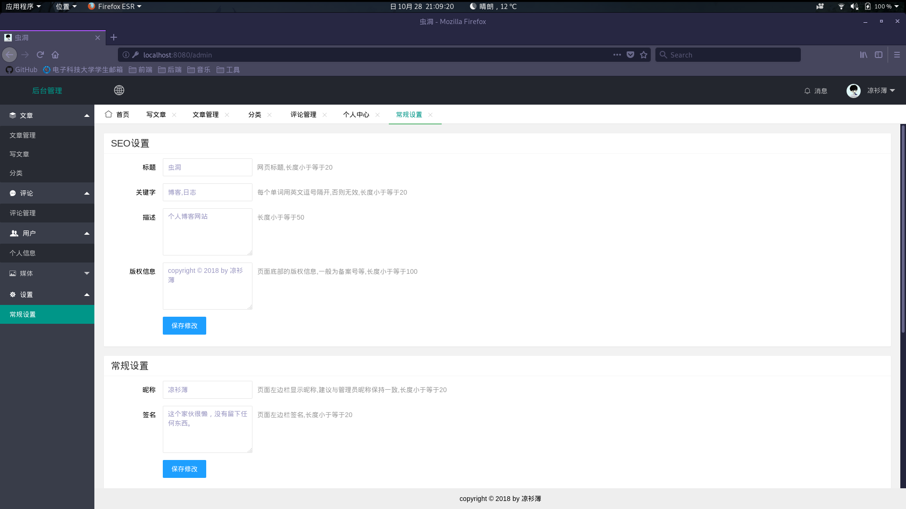
### 个人信息维护

### 用户注册界面
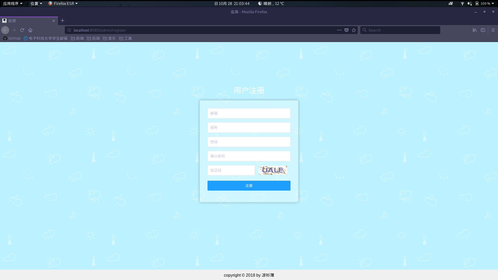
### 404界面
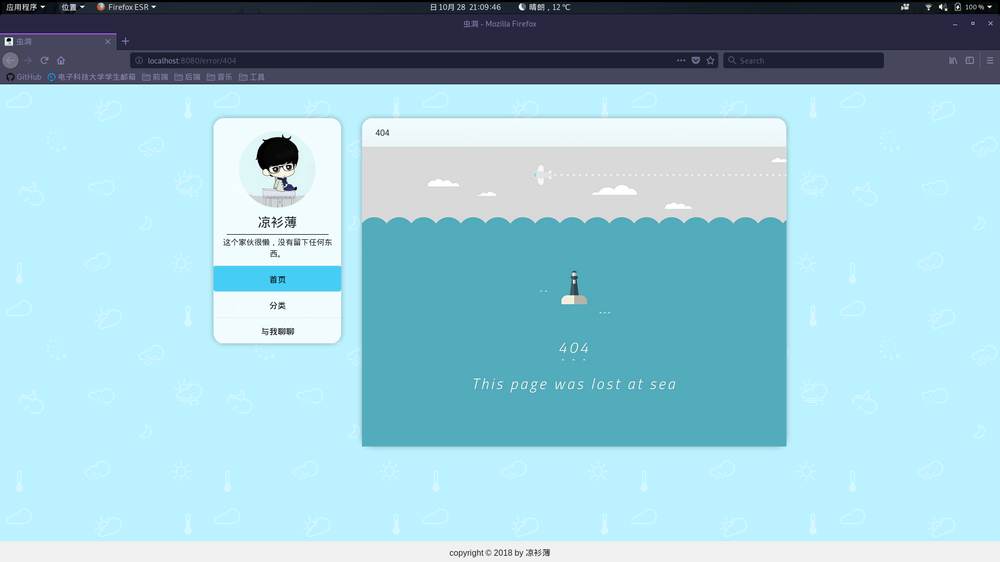
### 500界面
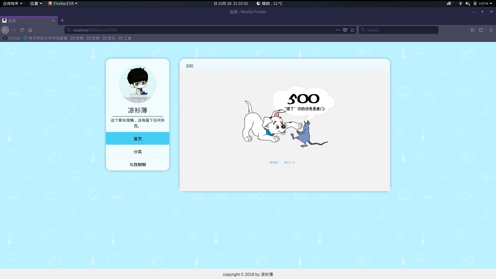


