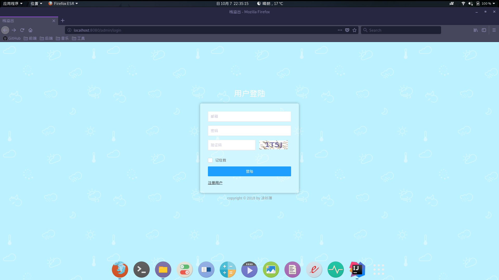
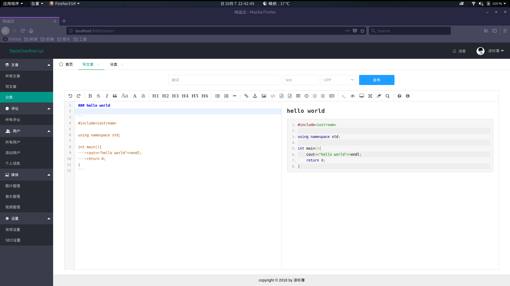
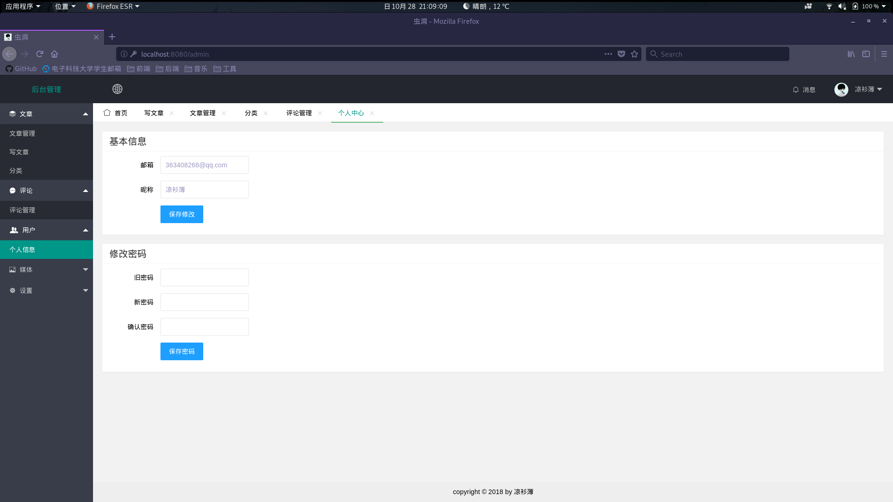

# BlOG
## 介绍
之前一直用的是[Wordpress](https://wordpress.org/)博客系统, 但感觉自由度不够高, 于是便想自己开发一个Java版本的博客系统.
这是一个基于互联网轻量级架构的博客系统, 所用到的都是当下比较流行的轻量级架构, 之后将会推出一个Spring Boot版本的, 敬请期待.

## 技术架构
* Ioc容器 - [Spring](https://spring.io/projects/spring-framework)
* MVC框架 - [Spring MVC](https://spring.io/projects/spring-framework)
* 持久化框架 - [Mybatis](http://www.mybatis.org/mybatis-3/)
* 缓存 - [Redis](https://redis.io/)
* 认证授权安全框架 - [Shiro](http://shiro.apache.org/)
* 模板渲染引擎 - [Freemarker](https://freemarker.apache.org/)
* 模块化前端框架 - [Layui](https://www.layui.com/)
* markdown编辑器 - [editor.md](http://pandao.github.io/editor.md/examples/)

## 运行环境
* JDK 1.8
* MySQL(MariaDB)
* Tomcat 9.0.8
* Redis 4.0.9

## 扩展接口
>该博客系统的后台管理系统虽然采用freemarker模板引擎,但博客主页,单页,分类页均采用前后端分离架构,方便用户自定义主题和扩展
### 获取验证码
* URL- http://host:port/api/vcode
* method - GET
### 获取所有文章
* URL - http://host:port/api/article
* method - GET
### 通过编码获取单篇文章
* URL - http://host:port/api/article/{articleCode}
* method - GET
### 获取所有文章分类信息
* URL - http://host:port/api/article/category
* method - GET
### 通过分类编码获取该分类下的所有文章
* URL - http://host:port/api/article/category/{categoryCode}
* method - GET
### 未完待补充

## 环境搭建
### Linux
1.下载并解压 [JDK 1.8](https://www.oracle.com/technetwork/java/javase/downloads/jdk8-downloads-2133151.html)
>注意不要用linux自带的openjdk
```
tar zxvf jdk-8u172-linux-x64.tar.gz
mv jdk1.8.0_172 /usr/local/jdk
```
2.下载并解压 [Redis 4.0.9](http://www.redis.cn/download.html)
```
tar zxvf redis-4.0.9.tar.gz
mv redis-4.0.9 /usr/local/redis
```
3.下载并解压 [Tomcat 9.0.8](https://tomcat.apache.org/download-90.cgi)
```
tar zxvf apache-tomcat-9.0.8.tar.gz
mv apache-tomcat-9.0.8 /usr/local/tomcat
```
4.安装MySQL或MariaDB
>注意!如果是mariadb需要将user表中的plugin字段值'unix_socket'改为'mysql_native_password',否则jdbc连接会出错
* Debian系列Linux参考以下过程
```
#apt-get update //获取最新软件包
#apt-get install mariadb mariadb-server //安装mariadb客户端和服务器
#service mysql start //启动服务
#mysql_security_installation //执行安全安装脚本
```
* Redhat系列Linux参考以下过程
```
#yum update
#yum install mariadb mariadb-server
#systemctl start mariadb
#mysql_security_installation
```
5.设置环境变量(用vim打开/etc/profile这个文件,在后面添加以下内容)
```
export JAVA_HOME=/usr/local/jdk
export JRE_HOME=$JAVA_HOME/jre
export CLASSPATH=.:$JAVA_HOME/lib/dt.jar:$JAVA_HOME/lib/tools.jar:$JAVA_HOME/lib:$JRE_HOME/lib:$CLASSPATH
export PATH=$JAVA_HOME/bin:$JRE_HOME/bin:$PATH

export CATALINA_HOME=/usr/local/tomcat
export CATALINA_BASE=/usr/local/tomcat
export PATH=$CATALINA_HOME/bin:$PATH

export PATH=/usr/local/redis/bin:$PATH
```
6.启动redis和tomcat
```
redis-server &
startup.sh
```
7.将打包好的war包放入tomcat的app目录
### Windows
步骤省略
### MAC
步骤省略

## 效果演示
### 登陆界面

### 后台管理





